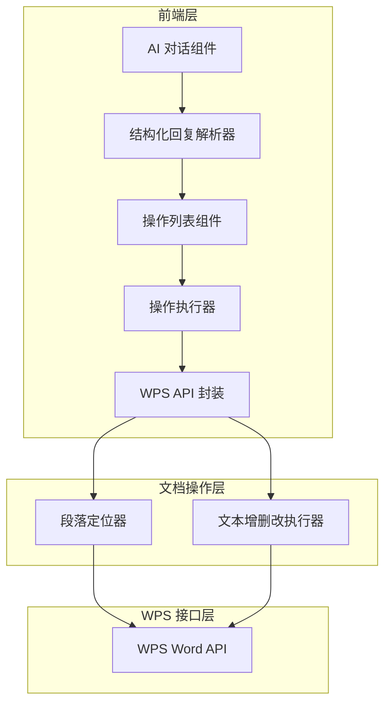

# 技术架构设计文档

## 1. 架构设计



## 2. 技术描述

- 前端：Vue 3 + Vite（现有技术栈）
- 样式：Scoped CSS（沿用现有风格）
- Markdown 解析：marked（已有依赖）
- WPS 交互：WPS 插件 API

## 3. 核心模块设计

### 3.1 结构化回复解析器

```typescript
// src/utils/documentOperationParser.ts

/**
 * 解析 AI 回复中的结构化操作指令
 */
export class DocumentOperationParser {
  /**
   * 从 Markdown 文本中提取 document-operations 代码块
   */
  static extractOperations(markdown: string): DocumentOperation[] {
    const regex = /```document-operations\s*\n([\s\S]*?)\n```/g;
    const operations: DocumentOperation[] = [];
    let match;
    
    while ((match = regex.exec(markdown)) !== null) {
      try {
        const jsonStr = match[1];
        const parsed = JSON.parse(jsonStr);
        if (Array.isArray(parsed)) {
          parsed.forEach((op, index) => {
            operations.push({
              ...op,
              id: `op-${Date.now()}-${index}`,
              confirmed: true,
              status: 'pending'
            });
          });
        }
      } catch (e) {
        console.error('解析操作指令失败:', e);
      }
    }
    
    return operations;
  }
  
  /**
   * 从 Markdown 中移除操作代码块，保留纯文本
   */
  static stripOperations(markdown: string): string {
    return markdown.replace(/```document-operations\s*\n[\s\S]*?\n```/g, '');
  }
}
```

### 3.2 操作列表组件 (DocumentOperationList.vue)

```vue
<!-- src/components/DocumentOperationList.vue -->
<template>
  <div class="document-operation-list">
    <!-- 批量操作栏 -->
    <div class="batch-actions" v-if="operations.length > 0">
      <button 
        class="batch-btn" 
        @click="toggleAll(true)"
      >
        全选
      </button>
      <button 
        class="batch-btn" 
        @click="toggleAll(false)"
      >
        全不选
      </button>
    </div>
    
    <!-- 操作列表 -->
    <div class="operation-items">
      <DocumentOperationItem
        v-for="op in operations"
        :key="op.id"
        :operation="op"
        @confirm="onConfirm"
        @locate="onLocate"
      />
    </div>
    
    <!-- 执行按钮 -->
    <div class="execute-actions" v-if="operations.length > 0">
      <button 
        class="execute-btn"
        :disabled="!hasConfirmedOperations"
        @click="executeOperations"
      >
        执行已确认的操作 ({{ confirmedCount }})
      </button>
    </div>
  </div>
</template>

<script setup lang="ts">
import { ref, computed } from 'vue';
import DocumentOperationItem from './DocumentOperationItem.vue';

interface Props {
  operations: DocumentOperation[];
}

const props = defineProps<Props>();
const emit = defineEmits<{
  execute: [operations: DocumentOperation[]];
}>();

const hasConfirmedOperations = computed(() => 
  props.operations.some(op => op.confirmed)
);

const confirmedCount = computed(() => 
  props.operations.filter(op => op.confirmed).length
);

const toggleAll = (confirmed: boolean) => {
  props.operations.forEach(op => {
    op.confirmed = confirmed;
  });
};

const onConfirm = (operation: DocumentOperation, confirmed: boolean) => {
  operation.confirmed = confirmed;
};

const onLocate = (operation: DocumentOperation) => {
  // 定位到文档位置
  locateDocumentPosition(operation);
};

const executeOperations = () => {
  const confirmedOps = props.operations.filter(op => op.confirmed);
  emit('execute', confirmedOps);
};
</script>
```

### 3.3 操作项组件 (DocumentOperationItem.vue)

```vue
<!-- src/components/DocumentOperationItem.vue -->
<template>
  <div class="operation-item">
    <div class="operation-header">
      <span class="operation-type" :class="operation.type">
        {{ getTypeLabel(operation.type) }}
      </span>
      <span class="operation-desc">{{ operation.description }}</span>
      <button class="locate-btn" @click="onLocate">
        📍 定位
      </button>
    </div>
    
    <div class="operation-position" v-if="hasPositionInfo">
      <span v-if="operation.position.page">第 {{ operation.position.page }} 页</span>
      <span v-if="operation.position.line">第 {{ operation.position.line }} 行</span>
      <span v-if="operation.position.paragraph">第 {{ operation.position.paragraph }} 段</span>
    </div>
    
    <div class="operation-content">
      <!-- 删除内容 -->
      <div v-if="operation.type === 'delete' || operation.type === 'replace'" class="old-content">
        <div class="content-label">删除/原内容：</div>
        <div class="content-text delete-text">{{ operation.oldContent }}</div>
      </div>
      
      <!-- 新增/替换内容 -->
      <div v-if="operation.type === 'insert' || operation.type === 'replace'" class="new-content">
        <div class="content-label">新增/新内容：</div>
        <div class="content-text insert-text">{{ operation.content }}</div>
      </div>
    </div>
    
    <div class="operation-footer">
      <label class="confirm-checkbox">
        <input 
          type="checkbox" 
          v-model="operation.confirmed"
          @change="onConfirm"
        />
        确认执行此操作
      </label>
    </div>
  </div>
</template>

<script setup lang="ts">
import { computed } from 'vue';

interface Props {
  operation: DocumentOperation;
}

const props = defineProps<Props>();
const emit = defineEmits<{
  confirm: [operation: DocumentOperation, confirmed: boolean];
  locate: [operation: DocumentOperation];
}>();

const hasPositionInfo = computed(() => 
  props.operation.position.page || 
  props.operation.position.line || 
  props.operation.position.paragraph
);

const getTypeLabel = (type: string) => {
  const labels: Record<string, string> = {
    'insert': '➕ 新增',
    'delete': '🗑️ 删除',
    'replace': '✏️ 修改'
  };
  return labels[type] || type;
};

const onConfirm = () => {
  emit('confirm', props.operation, props.operation.confirmed);
};

const onLocate = () => {
  emit('locate', props.operation);
};
</script>

<style scoped>
.operation-item {
  background: #f8f9fa;
  border-radius: 8px;
  padding: 12px;
  margin-bottom: 12px;
}

.operation-header {
  display: flex;
  align-items: center;
  gap: 10px;
  margin-bottom: 8px;
}

.operation-type {
  padding: 4px 10px;
  border-radius: 4px;
  font-size: 12px;
  font-weight: 600;
}

.operation-type.insert {
  background: #e8f5e9;
  color: #2e7d32;
}

.operation-type.delete {
  background: #ffebee;
  color: #c62828;
}

.operation-type.replace {
  background: #e3f2fd;
  color: #1565c0;
}

.operation-desc {
  flex: 1;
  font-size: 13px;
}

.locate-btn {
  padding: 4px 10px;
  border: 1px solid #ddd;
  border-radius: 4px;
  background: white;
  cursor: pointer;
  font-size: 12px;
}

.operation-position {
  font-size: 12px;
  color: #666;
  margin-bottom: 8px;
  display: flex;
  gap: 12px;
}

.operation-content {
  background: white;
  border-radius: 6px;
  padding: 10px;
  margin-bottom: 8px;
}

.content-label {
  font-size: 12px;
  color: #666;
  margin-bottom: 4px;
}

.content-text {
  font-size: 13px;
  line-height: 1.5;
  white-space: pre-wrap;
  word-break: break-word;
}

.delete-text {
  color: #c62828;
  text-decoration: line-through;
}

.insert-text {
  color: #2e7d32;
}

.operation-footer {
  display: flex;
  justify-content: flex-end;
}

.confirm-checkbox {
  display: flex;
  align-items: center;
  gap: 6px;
  font-size: 13px;
  cursor: pointer;
}
</style>
```

### 3.4 文档操作执行器

```typescript
// src/utils/documentOperationExecutor.ts

/**
 * 文档操作执行器
 */
export class DocumentOperationExecutor {
  /**
   * 执行单个操作
   */
  static async executeOperation(operation: DocumentOperation): Promise<boolean> {
    try {
      operation.status = 'executing';
      
      switch (operation.type) {
        case 'insert':
          return await this.executeInsert(operation);
        case 'delete':
          return await this.executeDelete(operation);
        case 'replace':
          return await this.executeReplace(operation);
        default:
          throw new Error(`未知操作类型: ${operation.type}`);
      }
    } catch (error) {
      console.error('执行操作失败:', error);
      operation.status = 'error';
      return false;
    }
  }
  
  /**
   * 批量执行操作
   */
  static async executeOperations(operations: DocumentOperation[]): Promise<{
    success: number;
    failed: number;
  }> {
    let success = 0;
    let failed = 0;
    
    for (const op of operations) {
      const result = await this.executeOperation(op);
      if (result) {
        op.status = 'success';
        success++;
      } else {
        op.status = 'error';
        failed++;
      }
    }
    
    return { success, failed };
  }
  
  /**
   * 执行新增操作
   */
  private static async executeInsert(operation: DocumentOperation): Promise<boolean> {
    if (!operation.content) return false;
    
    const range = await this.findPosition(operation.position);
    if (!range) return false;
    
    range.InsertAfter(operation.content);
    return true;
  }
  
  /**
   * 执行删除操作
   */
  private static async executeDelete(operation: DocumentOperation): Promise<boolean> {
    if (!operation.oldContent) return false;
    
    const range = await this.findText(operation.oldContent, operation.position);
    if (!range) return false;
    
    range.Delete();
    return true;
  }
  
  /**
   * 执行替换操作
   */
  private static async executeReplace(operation: DocumentOperation): Promise<boolean> {
    if (!operation.oldContent || !operation.content) return false;
    
    const range = await this.findText(operation.oldContent, operation.position);
    if (!range) return false;
    
    range.Text = operation.content;
    return true;
  }
  
  /**
   * 定位到文档位置
   */
  static async locatePosition(position: DocumentOperation['position']): Promise<void> {
    const range = await this.findPosition(position);
    if (range) {
      range.Select();
    }
  }
  
  /**
   * 根据位置信息查找 Range
   */
  private static async findPosition(position: DocumentOperation['position']): Promise<any> {
    // 优先使用上下文匹配
    if (position.contextStart && position.contextEnd) {
      return this.findByContextRange(position.contextStart, position.contextEnd);
    }
    
    if (position.context) {
      return this.findByContext(position.context);
    }
    
    // 使用段落号
    if (position.paragraph) {
      return this.findByParagraph(position.paragraph);
    }
    
    // 使用行号和页码（WPS API 可能需要其他方式）
    return null;
  }
  
  /**
   * 根据文本内容查找
   */
  private static async findText(text: string, position: DocumentOperation['position']): Promise<any> {
    try {
      const doc = window.Application?.ActiveDocument;
      if (!doc) return null;
      
      const range = doc.Range();
      range.Find.ClearFormatting();
      range.Find.Text = text;
      range.Find.Forward = true;
      range.Find.Wrap = 1; // wdFindStop
      
      const found = range.Find.Execute();
      if (found) {
        return range;
      }
    } catch (error) {
      console.error('查找文本失败:', error);
    }
    
    return null;
  }
  
  /**
   * 根据前后文定位
   */
  private static async findByContextRange(startText: string, endText: string): Promise<any> {
    try {
      const doc = window.Application?.ActiveDocument;
      if (!doc) return null;
      
      // 先找到起始位置
      const startRange = doc.Range();
      startRange.Find.Text = startText;
      if (!startRange.Find.Execute()) return null;
      
      // 再找到结束位置
      const endRange = doc.Range(startRange.End);
      endRange.Find.Text = endText;
      if (!endRange.Find.Execute()) return null;
      
      // 返回中间的 range
      return doc.Range(startRange.End, endRange.Start);
    } catch (error) {
      console.error('上下文定位失败:', error);
      return null;
    }
  }
  
  /**
   * 根据段落号定位
   */
  private static async findByParagraph(paragraphNum: number): Promise<any> {
    try {
      const doc = window.Application?.ActiveDocument;
      if (!doc) return null;
      
      const paragraphs = doc.Paragraphs;
      if (paragraphNum <= paragraphs.Count) {
        return paragraphs.Item(paragraphNum).Range;
      }
    } catch (error) {
      console.error('段落定位失败:', error);
    }
    
    return null;
  }
  
  /**
   * 根据上下文文本定位
   */
  private static async findByContext(context: string): Promise<any> {
    return this.findText(context, { context });
  }
}
```

## 4. 集成到现有 AIChat 组件

### 4.1 修改 AIChat.vue

在 [AIChat.vue](file:///home/jichong/Projects/wiki-wps-plugin/src/components/AIChat.vue) 中集成结构化操作功能：

1. 引入解析器和组件
2. 在消息展示中检测并解析操作
3. 展示操作列表
4. 处理执行操作

```typescript
// 在 AIChat.vue 中添加的关键代码

// 引入依赖
import DocumentOperationList from './DocumentOperationList.vue';
import { DocumentOperationParser } from '../utils/documentOperationParser';
import { DocumentOperationExecutor } from '../utils/documentOperationExecutor';

// 添加响应式数据
const messageOperations = ref<Map<string, DocumentOperation[]>>(new Map());

// 解析消息中的操作
const parseMessageOperations = (message: any) => {
  if (message.role === 'assistant' && message.content) {
    const operations = DocumentOperationParser.extractOperations(message.content);
    if (operations.length > 0) {
      messageOperations.value.set(message.id, operations);
    }
  }
};

// 执行操作
const handleExecuteOperations = async (messageId: string, operations: DocumentOperation[]) => {
  if (!window.Application?.ActiveDocument) {
    alert('请先打开一个 WPS 文档');
    return;
  }
  
  const result = await DocumentOperationExecutor.executeOperations(operations);
  alert(`操作完成：成功 ${result.success} 个，失败 ${result.failed} 个`);
};

// 定位操作
const handleLocateOperation = async (operation: DocumentOperation) => {
  if (!window.Application?.ActiveDocument) {
    alert('请先打开一个 WPS 文档');
    return;
  }
  
  await DocumentOperationExecutor.locatePosition(operation.position);
};
```

## 5. 样式规范

沿用现有项目的样式风格：
- 主色调：`#667eea` 到 `#764ba2` 渐变
- 圆角：`8px` 或 `12px`
- 字体：继承系统字体，13-14px
- 间距：使用 4px、8px、12px、16px 等标准化间距
- 过渡动画：`0.2s` ease 或 ease-in-out
