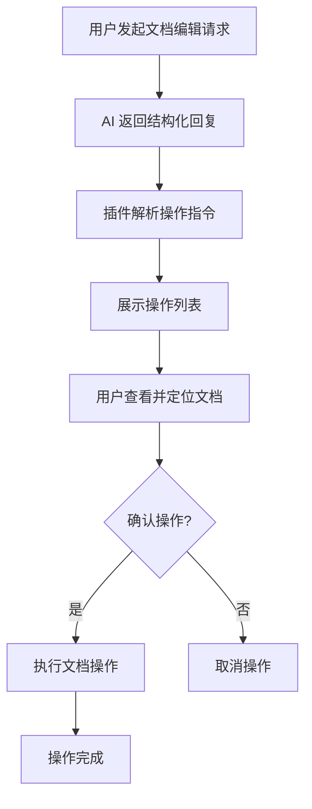

# 结构化文档编辑功能设计文档

## 1. 产品概述

这是 WPS AI 插件的结构化文档编辑功能，允许用户通过友好的界面确认、预览并执行文档的增删改操作。

- 解决问题：AI 助手的回复需要用户手动处理，缺乏直观的操作确认和自动化执行
- 目标用户：使用 WPS 插件进行文档编辑的用户
- 市场价值：提升文档编辑效率，减少手动操作

## 2. 核心功能

### 2.1 用户角色

| 角色 | 注册方式 | 核心权限 |
|------|----------|----------|
| 普通用户 | 无需注册 | 使用所有文档编辑功能 |

### 2.2 功能模块

1. **AI 对话页面**：结构化回复解析、操作列表展示、确认/取消按钮
2. **文档操作模块**：定位文档位置、执行增删改操作、实时预览

### 2.3 页面详情

| 页面名称 | 模块名称 | 功能描述 |
|----------|----------|----------|
| AI 对话页面 | 结构化回复解析 | 解析 AI 回复中的操作指令，提取增删改信息 |
| AI 对话页面 | 操作列表展示 | 可视化展示所有待执行的操作，包含前后文对比 |
| AI 对话页面 | 确认执行 | 用户点击确认后自动执行所有操作 |
| AI 对话页面 | 段落定位 | 点击操作可自动定位到文档对应位置 |
| AI 对话页面 | 单条操作确认 | 支持单条操作的确认/取消 |

## 3. 核心流程

1. 用户与 AI 对话，请求文档编辑
2. AI 返回包含结构化操作指令的回复
3. 插件解析结构化指令，在对话中展示操作列表
4. 用户查看每个操作的详情，可点击定位到文档
5. 用户确认执行或单条确认
6. 插件自动执行所有确认的操作



## 4. 用户界面设计

### 4.1 设计风格
- 主色：#667eea（沿用现有主题）
- 辅助色：#764ba2（渐变）
- 按钮样式：圆角渐变按钮，悬停有缩放效果
- 字体：继承系统字体，13-14px
- 布局风格：卡片式，垂直排列操作项
- 图标：使用统一的 emoji 图标，增强视觉识别度

### 4.2 页面设计概述

| 页面名称 | 模块名称 | UI 元素 |
|----------|----------|---------|
| AI 对话页面 | 操作卡片 | 浅色背景卡片，包含操作类型标签、位置信息、前后文对比、确认按钮 |
| AI 对话页面 | 操作类型标签 | 颜色区分：新增（绿色）、删除（红色）、修改（蓝色） |
| AI 对话页面 | 位置信息 | 显示页码、行号、段落定位按钮 |
| AI 对话页面 | 批量操作 | 顶部全选/全不选按钮，底部批量确认按钮 |
| AI 对话页面 | 前后文对比 | 删除内容划红线，新增内容标绿，修改内容左右对比 |

### 4.3 响应性
- 桌面端：充分利用侧边栏宽度，卡片完整展示
- 触摸优化：按钮尺寸足够大，便于点击

## 5. 结构化回复格式规范

### 5.1 基本格式

结构化回复使用 Markdown 代码块包裹，格式如下：

```document-operations
[
  {
    "type": "insert|delete|replace",
    "position": {
      "page": 1,
      "line": 10,
      "paragraph": 3,
      "context": "前后文匹配文本",
      "contextStart": "定位起始文本",
      "contextEnd": "定位结束文本"
    },
    "content": "新增或替换的内容",
    "oldContent": "被删除或替换的原内容",
    "description": "操作说明"
  }
]
```

### 5.2 操作类型

#### 新增 (insert)
```json
{
  "type": "insert",
  "position": {
    "page": 2,
    "line": 15,
    "paragraph": 5,
    "contextStart": "前一段落的结尾文本",
    "contextEnd": "后一段落的开始文本"
  },
  "content": "要插入的新内容",
  "description": "在第5段后插入新段落"
}
```

#### 删除 (delete)
```json
{
  "type": "delete",
  "position": {
    "page": 1,
    "line": 8,
    "paragraph": 2,
    "context": "包含要删除内容的完整段落"
  },
  "oldContent": "要删除的内容",
  "description": "删除第2段中的冗余内容"
}
```

#### 修改 (replace)
```json
{
  "type": "replace",
  "position": {
    "page": 3,
    "line": 22,
    "paragraph": 7,
    "context": "包含要修改内容的段落文本"
  },
  "oldContent": "原内容",
  "content": "新内容",
  "description": "将原表述修改为更正式的表达"
}
```

### 5.3 嵌入 Markdown 的方式

AI 回复可以混合普通文本和结构化操作：

```markdown
好的，我已经分析了您的文档，建议进行以下修改：

## 主要修改建议

1. 优化引言部分
2. 补充实验数据
3. 调整结论表述

```document-operations
[
  {
    "type": "replace",
    "position": {
      "page": 1,
      "paragraph": 1,
      "contextStart": "随着科技的发展",
      "contextEnd": "越来越重要"
    },
    "oldContent": "随着科技的发展，人工智能变得越来越重要",
    "content": "随着人工智能技术的快速发展，其在各个领域的应用变得越来越重要",
    "description": "优化引言开头，使表述更准确"
  },
  {
    "type": "insert",
    "position": {
      "page": 2,
      "paragraph": 4,
      "contextStart": "实验结果表明",
      "contextEnd": "综上所述"
    },
    "content": "\n根据最新的实验数据，我们的方法在准确率上提升了 15%。\n",
    "description": "补充实验数据段落"
  }
]
```

您可以预览以上修改，确认后点击执行。
```

## 6. 数据结构定义

### 6.1 操作对象 (DocumentOperation)

```typescript
interface DocumentOperation {
  id: string;
  type: 'insert' | 'delete' | 'replace';
  position: {
    page?: number;
    line?: number;
    paragraph?: number;
    context?: string;
    contextStart?: string;
    contextEnd?: string;
  };
  content?: string;
  oldContent?: string;
  description: string;
  confirmed: boolean;
  status: 'pending' | 'executing' | 'success' | 'error';
}
```
